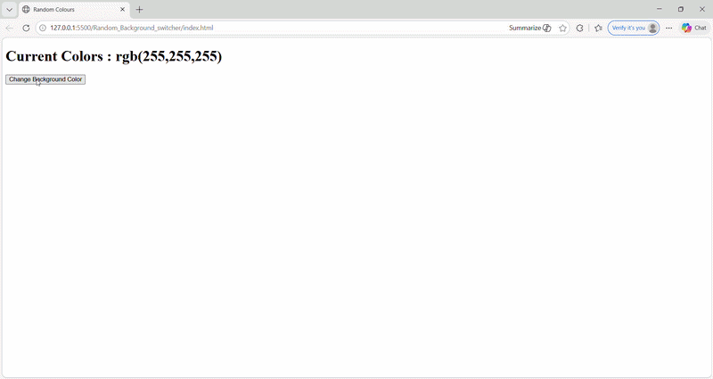
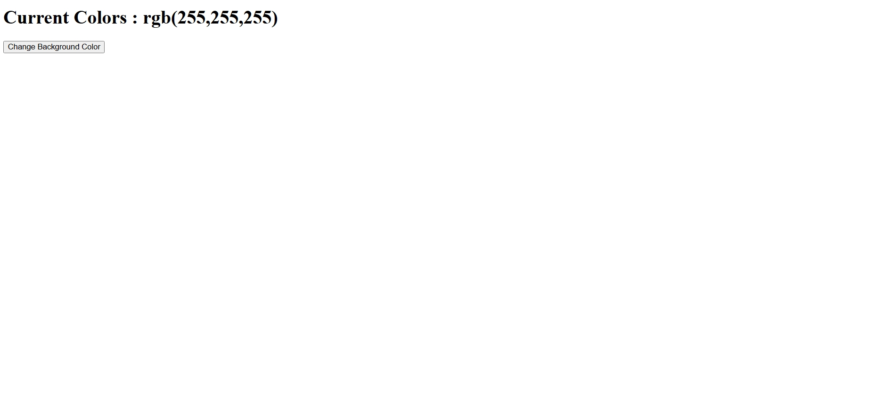
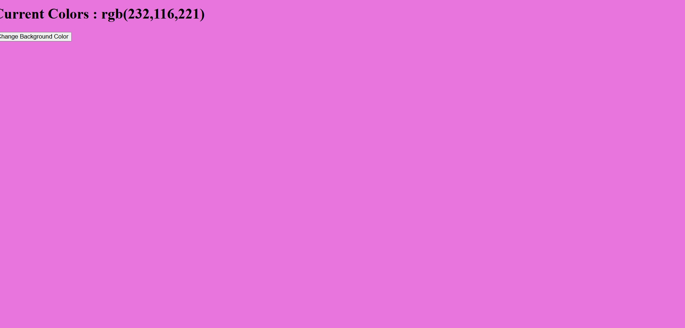
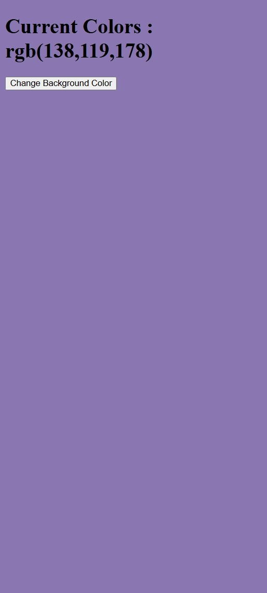

# 🎨 JavaScript Background Color Changer


A simple and interactive **Background Color Changer Web Application** built using **Vanilla JavaScript**, allowing users to dynamically change the background color with instant visual feedback.

---

## 🚀 Live Demo

🌐 **Live App:** https://khushi-66.github.io/javascript-background-colour-changer/

📂 **GitHub Repository:** https://github.com/khushi-66/javascript-background-colour-changer

---

## 🎥 Live Preview



---

## 📌 Overview

This project demonstrates fundamental JavaScript concepts such as **DOM manipulation**, **event handling**, and **dynamic UI updates**.

It focuses on:

* Real-time UI changes based on user interaction
* Handling events efficiently
* Building a clean and responsive interface

---

## 🧠 Key Learnings

* Manipulating DOM elements dynamically
* Handling click events in JavaScript
* Updating styles using JavaScript
* Writing clean and structured code
* Understanding user interaction flow

---

## 📸 Screenshots

### 🎨 Default Interface



### 🌈 Background Color Change



### 📱 Mobile View



---

## ✨ Features

* 🎨 Change background color dynamically
* ⚡ Instant UI updates
* 🎯 Simple and intuitive interface
* 📱 Fully responsive design
* 🧩 Lightweight and fast

---

## ⚡ Performance & Optimization

* No external libraries (pure JavaScript)
* Fast DOM updates for smooth interaction
* Minimal and efficient code structure
* Lightweight and quick loading

---

## 🛠️ Tech Stack

| Technology            | Usage     |
| --------------------- | --------- |
| **HTML5**             | Structure |
| **CSS3**              | Styling   |
| **JavaScript (ES6+)** | Logic     |

---

## 🌐 Deployment

This project is deployed using **GitHub Pages**, making it publicly accessible worldwide.

### 🚀 Deployment Process:

* Uploaded project to GitHub repository
* Enabled GitHub Pages in repository settings
* Selected main branch for deployment
* Generated a live public URL

---

## 📂 Project Structure

```bash id="k3l9m1"
javascript-background-colour-changer/
│── index.html
│── style.css
│── script.js
│── screenshots/
│── assets/
│── README.md
```

---

## ⚙️ Installation & Setup

```bash id="q7w8e9"
git clone https://github.com/khushi-66/javascript-background-colour-changer.git
cd javascript-background-colour-changer
```

Open `index.html` in your browser 🚀

---

## 📈 Future Improvements

* 🎨 Add custom color picker
* 🌈 Gradient background support
* 💾 Save selected color (LocalStorage)
* 🌙 Dark/Light mode toggle
* 🎯 Add predefined color palettes

---

## 👩‍💻 Author

**Khushi Sahu**
🔗 https://github.com/khushi-66

---

## ⭐ Support

If you like this project, give it a ⭐ on GitHub!
